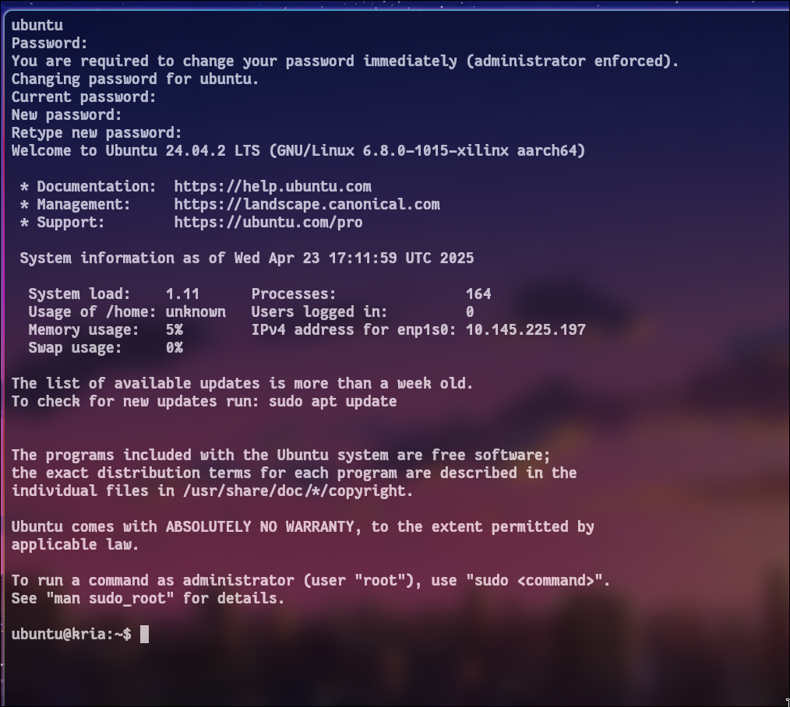
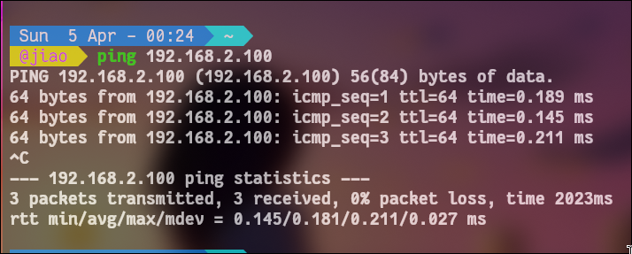
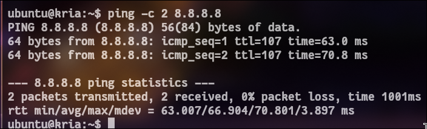
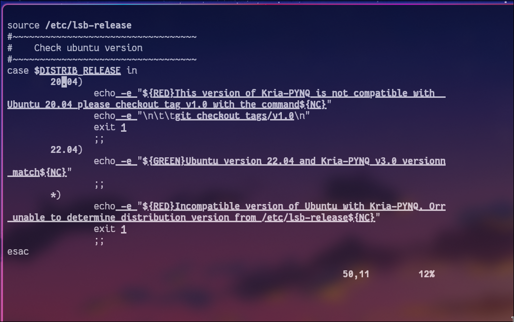

# kv260 migration

这是设计第五阶段的部分，尝试通过移植到kv260获取更好性能，以及确认设计的灵活性。

# 硬件对比

我们之前使用的是PYNQ-Z2板子，首先来看一下两者的硬件规格对比。

| 规格           | PYNQ-Z2 7020(xc7z020)         | KV260(xck26 / ZU5EV)            |
| -------------- | ----------------------------- | ------------------------------- |
| 架构           | Zyqnnq-7000                   | Zynq UltraScale + MPSoC         |
| PS             | Cortex-A9 x 2(32-bit, 650MHz) | Cortex-A53 x 4 (64-bit, 1.3GHz) |
| LUT            | 53,200                        | 117,120(2.2x)                   |
| FF             | 106,400                       | 234,240(2.2x)                   |
| BRAM(36Kb)     | 140(4.9Mb)                    | 144(5.1Mb)                      |
| UltraRAM       | 0                             | 64(27Mb)                        |
| DSP            | 220                           | 1,248(5.7x)                     |
| PS DRAM        | 512MB DDR3                    | 4GB DDR4                        |
| PL clk source  | PS FCLK_CLK0                  | PS pl_clk0                      |
| PL default clk | none                          | 100MHz                          |
| AXI GP port    | M_AXI_GP0(32-bit)             | M_AXI_HPM0_FPD(128-bit)         |
| PS IP(vivado)  | processing_system7            | zynq_ultra_ps_e                 |
| Board part     | tul.com.tw:pynq-z2:part0:1.0  | xilinx.com:kv260_som:part0:1.4  |
| PMOD           | PMODA/PMODB <-> PL            | J2 PMOD, carrier                |
| PL LED         | 4                             | none                            |
| PYNQ install   | pynq + SD card                | Ubuntu22.04 + Kria-PYNQ         |
| vivado         | 2024.2                        | 2024.2                          |

可以发现，换成kria kv260，

- 可以获得5.7倍数量的DSP，在`PAR_OB=1`的情况下，只使用了大约55个DUT，换成kv260可以获得成倍的性能提升；

- UltraScale+工艺，可以放宽时序收敛条件，之前需要放宽到60MHz才能收敛的，在新板子上可能100MHz就可以收敛；

- 4GB DDR4，我们可以加载更大的模型，不再受限于PL BRAM，可以直接通过PS DDR加载；

- AXI 128bits，带宽也有4倍提升。

# immigration

关于将项目移植到Kira KV260.

关于原项目的所有RTL，还有PicoRV32的RTL和python，这些是纯粹的逻辑电路或者是算法，和FPGA型号无关，因此无需修改，具体包括如下内容：

```
hw/rtl
picorv32/hw/rtl
picorv32/fw
sw
```

需要改或者新写的内容有：

| files                                 | description                    |
| ------------------------------------- | ------------------------------ |
| kv260/hw/scripts/vivado_build.sh(tcl) | 需要修改一些端口，更新连接方式 |
| kv260/hw/constraints/cim_kv260.xdc    | 如有用到，还需要修改PMOD映射   |

## TCL

除了端口和连线，主要还是板型的修改：

```tcl
# PYNQ-Z2:
set PART       "xc7z020clg400-1"
set BOARD_PART "tul.com.tw:pynq-z2:part0:1.0"
create_bd_cell -type ip -vlnv xilinx.com:ip:processing_system7:5.5 ps7
# 时钟: ps7/FCLK_CLK0
# AXI:  ps7/M_AXI_GP0
# 复位: ps7/FCLK_RESET0_N

# KV260:
set PART       "xck26-sfvc784-2LV-c"
set BOARD_PART "xilinx.com:kv260_som:part0:1.4"
create_bd_cell -type ip -vlnv xilinx.com:ip:zynq_ultra_ps_e:3.5 ps_e
# 时钟: ps_e/pl_clk0
# AXI:  ps_e/M_AXI_HPM0_FPD
# 复位: ps_e/pl_resetn0
```

## XDC

由于连线和引脚完全不同，这一部分还需要查看文档之后再写。

# Kria KV260上板准备

## env

这里需要的硬件和之前几乎一致，只多一个供电方式：

- Kria KV260 Vision AI Starter Kit
- 12V/3A 电源适配器
- microSD card
- 网线
- micro USB线

首先去官网下载Ubuntu和PYNQ镜像。

Ubuntu镜像可以在[这里](https://people.canonical.com/~platform/images/xilinx/kria-ubuntu-22.04/) 或者[这里](https://ubuntu.com/download/amd#kria-k26)下载，文件名类似`iot-limerick-kria-classic-desktop-2204-****.img.xz`，下载完成之后可以用balenaetcher或者其他工具写入SD卡。

我下载的镜像叫：`iot-limerick-kria-classic-server-2404-classic-24.04-x07-20250423.img.xz`.

准备完镜像SD卡之后，将SD卡插入Kria KV260，连接电源和网线开机。

如果需要登录，默认用户名和密码都是`ubuntu`.



这个系统默认是`NetworkManager`管理网络。

不过在没有路由器的环境中，可以先不进行Kria的联网。

首先我们把本地网卡设置为`192.168.2.1/24`，然后在串口中把Kria ip设置为`192.168.2.100/24`，pc修改具体方法可见`onboard_guide_PYNW-Z2.md`，kv260修改方式如下：

```bash
sudo ip addr add 192.168.2.100/24 dev eth0
sudo ip route add default via 192.168.2.1
echo "nameserver 8.8.8.8" | sudo tee /etc/resolv.conf
```

这样就实现了本地联通：



```bash
ping 192.168.2.100 # pc
ping -c 2 8.8.8.8 # kv260

```

如果第二个ping不通，就需要让pc做NAT转发。

首先确认电脑网口名：

```bash
ip -br addr
```

由于我实际上用wifi联网，所以选择wlpxxx转发。此时有两个端口需要注意，wlpxxx用来转发网络，enpyyy也就是被改成`192.168.2.1`和kv260连接的网口接收转发的网络，命令如下:

```bash
sudo sysctl -w net.ipv4.ip_forward=1
sudo iptables -t nat -A POSTROUTING -o wlpxxx -j MASQUERADE
sudo iptables -A FORWARD -j ACCEPT
```



在kv260内部可以ping通，则说明kv260已经通过网线借用了pc的网络。（和virtualbox有"**_同曲同工_**"之妙。）

然后我们需要进入ubuntu系统，在系统中安装`Kria-PYNQ`：

```bash
git clone https://github.com/Xilinx/Kria-PYNQ.git
cd Kria-PYNQ
sudo bash install.sh -b KV260
```

_有人可能会问了，不配置proxy要怎么git clone？
当然要配proxy，不过这个知识太基础了，简单略过。如果不会，也可往下看。_

_还会有人问，这个下载好慢，我可以下完传过去吗？
当然是可以的，本地都ping通了。_

首先在pc上：

```bash
git clone https://github.com/Xilinx/Kria-PYNQ.git
scp -r Kria-PYNQ ubuntu@192.168.2.100:~/
```

这样就传过去了。（其实和`onboard_guide_PYNW-Z2.md`中的jupyter download有"**_同曲同工_**"之妙。简单的计算机网络知识。）

然后在kv260上：

```bash
cd ~/Kria-PYNQ
sudo bash install.sh -b KV260
```

进行安装。

_这里有个问题，我安装22.04失败了才换成的24.04，结果脚本只支持到22.04，所以我只好进行一次危险的操作：把脚本的22.04改成24.04._



还有很多问题，比如说还需要把所有`install.sh`的`python3.10`换成`python3.12`，因为新的镜像自带的是3.12...

可以把`/kv260/install.sh`用`scp -r install.sh ubuntu@192.168.2.100:~/`传到kv260.

_install 总归有一些pip和apt操作，所以可以换一下国内源进行加速。
当然这个也很基础，就不讲了。_

硬等也是可以完成安装的，除此之外，还可以把之前的`git clone`换成`git clone --recursive https://github.com/Xilinx/Kria-PYNQ.git`稍微加快一下。如果这样的话，通过`:%s/git clone/#git clone/g`屏蔽所有kv260 上的脚本的git clone节省时间。

在安装完成之后，可以访问JupyterLab，在浏览器中输入`http://<kv260_ip>:9090/lab`，密码是`xilinx`.

最后需要注意的是vivado版本不能太低，需要支持Kria KV260.

- _可能出现的问题：
  访问pypi如果网络很慢，就会导致下载失败。这个时候我们可以在pc下好，然后scp传过去。_

```bash
pip download pynqmetadata pynqutils pynq -d /tmp/pynq_pkgs/ --no-deps
scp -r /tmp/pynq_pkgs ubuntu@192.168.2.100:~/
```

在kv260上激活环境之后继续安装：

```bash
pip install  --find-links ~/pynq_pkgs pynqmetadata pynqutils pynq
```

- _如果还是无法安装，其实也不用下载这么多东西，只要下载pynq就好了：_

```bash
sudo apt update
sudo apt install -y python3-pip python3-venv

python3 -m venv ~/pynq-env
source ~/pynq-env/bin/activate

pip install pynq

python3 -c "from pynq import Overlay, MMIO; print('PYNQ OK')"
```

当然如果下载`pynq`失败了，也可以通过pc下好scp传过去：

```bash
pip download pynq -d ./pynq_pkgs

cp -r ./pynq_pkgs ubuntu@<kv260_ip>:~/
```

然后在kv260上面安装：

```bash
pip install --no-index --find-links ~/pynq_pkgs pynq
```

## aother way

这是一条未曾设想的道路，来自烧录完成之后。

突然想到读取的22.04镜像出现乱码其实可能是因为板子firmware太旧了，所以尝试一下通过在24.04镜像上更新firmware之后能不能完成22.04镜像正常打开。

在24.04打开之后，配好NAT，更新firmware:

```bash
sudo apt update
sudo xmutil bootfw_update -i /usr/lib/firmware/xilinx/kv26-starter-kits/*.bin
```

然后再次尝试烧录22.04镜像。

## bitstream

可以选择移植ARM控制版本或者是PicoRV32控制的版本。ARM版本是PS直接通过AXI控制CIM，最简单，可以用于快速验证KriaKV260上能不能完成功能，而且验证也很简单，PYNQ notebook应该不用修改；如果选择PicoRV32，这就是PicoRV32控制PL自主推理，然后PS通过BRAM读出结果，可以完整展示RISC-V + CIM架构。

# 性能提升

KV260 的资源足以支持以下优化：

| 优化项            | 改什么                | 预期效果     |
| ----------------- | --------------------- | ------------ |
| `PAR_OB=4`        | `cim_pkg.sv` 一行     | 推理速度 ×4  |
| `PAR_OB=8`        | 同上                  | 推理速度 ×8  |
| 提频到 100MHz     | TCL 里 `FCLK_MHZ`     | 速度 ×2      |
| 提频到 150MHz+    | 可能需要加 MAC 流水线 | 速度 ×3      |
| `MAX_IN_DIM=1024` | `cim_pkg.sv`          | 支持更大网络 |

DSP 预算（cim_tile MAC 用量）：

| PAR_OB | DSP48 估算 | PYNQ-Z2 (220) | KV260 (1248) |
| ------ | ---------- | ------------- | ------------ |
| 1      | ~55        | ✓             | ✓            |
| 4      | ~220       | 刚好用完      | ✓ (18%)      |
| 8      | ~440       | ✗ 超了        | ✓ (35%)      |
| 16     | ~880       | ✗             | ✓ (70%)      |

# 性能对比

| 指标            | PYNQ-Z2 | KV260 |
| --------------- | ------- | ----- |
| 时钟频率        | 60 MHz  | ? MHz |
| PAR_OB          | 1       | ?     |
| MLP 推理 cycles | ~2700   | ?     |
| MLP 推理延迟    | ~45 μs  | ? μs  |
| LeNet-5 cycles  | ~76000  | ?     |
| LUT 占用        | 23%     | ?%    |
| DSP 占用        | 100%    | ?%    |
| BRAM 占用       | 46%     | ?%    |

# 需要注意的事情

- KV260没有板载LED，KV260的LED没有直连PL信号，LED都在PS MIO上，PL不能直接驱动，如果需要LED反馈，还需要连接外部LED到PMOD.

- KV260的PMOD连接和PYNQ-Z2完全不同。不过如果不需要UART TX，其实不约束PMOD pin也可以。

- AXI地址空间和PYNQ-Z2不同。PYNQ-Z2 的 `M_AXI_GP0` base 是 `0x4000_0000`，KV260 的 `M_AXI_HPM0_FPD` 默认映射到 `0xA000_0000`。PYNQ notebook 里的 `MMIO(0x40000000, ...)` 需要改为实际分配的地址。可以用 `ol.ip_dict` 查看。

另：相关文档比如官方XDC等可以在amd/xilinx官方文档站点下载。

比如：

- https://xilinx.github.io/kria-apps-docs/kv260/2022.1/build/html/docs/linux_boot.html

- https://docs.amd.com/v/u/en-US/dh339-kria-kv260-vision-ai-starter-kit
