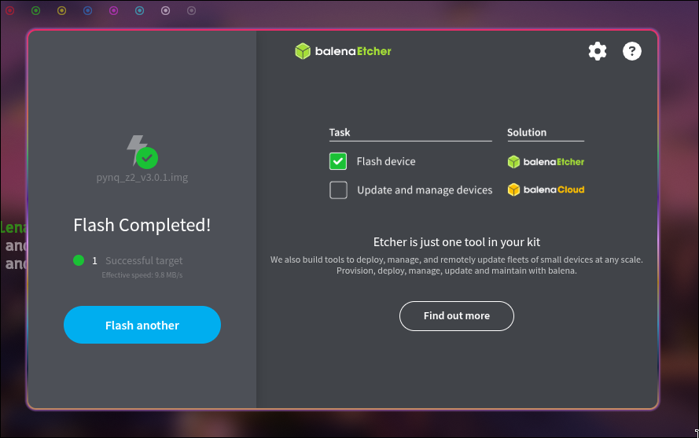
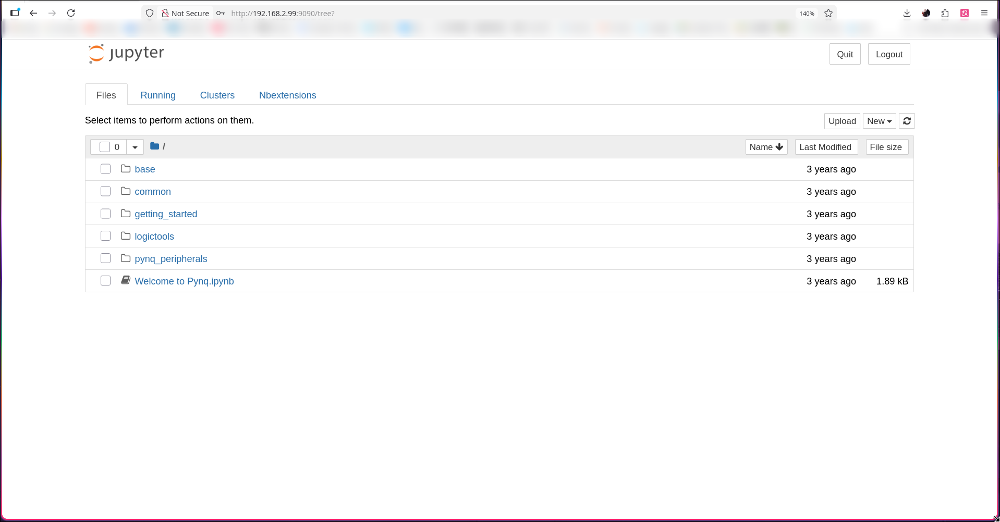

# onboard guide PYNQ-Z2

这次的设计是用PS(ARM)驱动的，并不使用PYNQ-Z2板子上的按键和开关，操作会通过Jupyter Notebook里面的代码完成，ARM通过AXI总线直接读写PL里面的CIM加速器硬件。

## 前置条件

1. 需要PYNQ image（从[TUL 网站](https://www.tulembedded.com/fpga/ProductsPYNQ-Z2.html)下载）

2. 完成从SD卡的PYNQ image启动。

3. 使用Jupyter Notebook实现后续操作。

### image烧录

这个大家应该都挺熟悉，但是还是简单说一下。

首先下载好镜像，我这里使用的是`pynq_z2_v3.0.1`镜像。下载之后，用读卡器将SD卡连接到电脑USB口，通过烧录软件将镜像烧录到SD卡中，此处我使用的是balena etcher.



将镜像烧录好之后，把板子的跳线设置为SD卡启动，上电方式根据具体情况选择，如果是选择适配器供电则将跳线设置为`REG`，如果是USB-uart供电则是设置为`USB`. 初次启动可能用时较长，等到闪烁蓝灯就说明已经从SD卡启动了。

### PYNQ连接到PC

连接有两种方式，一种是uart，一种是网线连接。

这里两个方法都有坑。首先是uart，一定要选择micro-USB(A)数据线，而不是充电线。充电线只能供电，不能实现串口传输。接上之后，通过`sudo dmesg | grep "tty"`找到新增接口，应该类似`ttyUSBx`，找到接口之后，我们就可以通过minicom或者是putty进行串口连接。我这里使用的是`minicom`，连接方式是：`minicom -D /dev/ttyUSBx -b 115200`，看到有相关信息，则说明启动成功（如果错误了启动信息，输入`ls`有回应即可）。

第二个是通过网线连接。如果有路由器，直接让电脑连接路由器网络然后板子网线连接路由器是最简单的解法，但是有些时候没有路由器，只能使用电脑的网卡，这个就需要配置好IP.

对于laptop来说，我们需要首先将有线网卡IP手动设置为`192.168.2.1`，子网掩码`255.255.255.0`，网关留空。

可以通过`ip link`找到网卡，一般来说，网卡是`enp`开头，wifi是`wlp`开头，`lo`,`docker0`等不要理会。找到之后，手动设置ip：

```bash
sudo ip addr flush dev enpxxx

sudo ip addr add 192.168.2.1/24 dev enpxxx

sudo ip link set enpxxx up
```

不过这个设置重启之后会丢失。如果持久修改，使用NetworkManager:

```bash
nmcli con add type ethernet ifname enpxxx con-name pynq ip4 192.168.2.1/24 method manual
nmcli con up pynq
```

不过一般不建议持久化，因为持久化修改可能会影响电脑平时的网络配置（配置过虚拟机EDA软件的都知道，即使是改了网卡名字也要改好多配置文件不然就会连不上网）。

PYNQ启动后，默认IP是`192.1688.2.99`，如果没有的话可以通过`ip a`来查询；在浏览器中打开`http://129.168.2.99:9090`即可登录，默认账号和密码都是`xilinx`.

_如果是路由器连接，直接ip a找到板子ip就好了。如果ip a找不到，默认IP也不对，可以先用串口连接，进入PYNQ镜像之后，在串口中输入ip a查询板子的IP._



## 使用流程（有线网卡或路由）

### 上传部署文件

将`cim_soc.bit`和`cim_soc.hwh`上传到PYNQ的Jupyter同一目录下。（两个文件除后缀必须同名）

### cim_basic_test

新建一个ipynb(cim_basic_test.ipynb)，进行基本测试。

```python
from pynq import Overlay, MMIO
import numpy as np

# ---- 加载 bitstream ----
ol = Overlay("cim_soc.bit")
print("Overlay loaded!")

# ---- MMIO ----
BASE = 0x40000000
mmio = MMIO(BASE, 0x1000)

# ---- CSR 地址 ----
CTRL   = 0x000
STATUS = 0x004
IN_DIM = 0x010

# ---- 测试1: 读 STATUS 寄存器 ----
status = mmio.read(STATUS)
print(f"STATUS = 0x{status:08x}  (expect: busy=0, done=0)")

# ---- 测试2: 写再读 IN_DIM ----
mmio.write(IN_DIM, 784)
readback = mmio.read(IN_DIM)
print(f"IN_DIM write=784, readback={readback}  {'PASS' if readback == 784 else 'FAIL'}")

# ---- 测试3: 软复位 ----
mmio.write(CTRL, 0x4)
status = mmio.read(STATUS)
print(f"After soft_rst: STATUS = 0x{status:08x}")

print("\n=== AXI connectivity test done ===")
```

以上内容如果正确，说明PS<-->PL通路正常，接下来可以跑完整推理。

### full_cim_test

然后可以进行完整推理。首先在PC生成数据：

```bash
cd sw/
python3 golden_model.py --mnist-e2e --output-dir mnist_data
```

然后把mnist_data上传到PYNQ，在notebook(full_test.ipynb)里面跑完整推理代码：

```python
"""
cim_mnist_test.py — Complete PYNQ on-board MNIST inference test
================================================================
Usage:
  1. PC端: cd sw/ && python3 golden_model.py --mnist-e2e --output-dir mnist_data
  2. 把 mnist_data/ 目录、cim_soc.bit、cim_soc.hwh、本文件 一起传到 PYNQ Jupyter
  3. Jupyter 里 Run All，或者串口终端: python3 cim_mnist_test.py

本脚本会:
  - 加载 bitstream
  - 从 hex 文件读取权重/偏置/输入/期望输出/量化参数
  - 跑 FC1 (784→128 ReLU) + FC2 (128→10 None) 两层推理
  - 逐元素对比 RTL 输出与 golden，打印 PASS/FAIL
================================================================
"""

from pynq import Overlay, MMIO
import numpy as np
import os

# ====================================================================
# 1. 加载 bitstream
# ====================================================================
ol = Overlay("cim_soc.bit")
print("Overlay loaded!")

BASE = 0x40000000
mmio = MMIO(BASE, 0x4000)   # 16KB address space

# ====================================================================
# 2. CSR 地址定义 (与 cim_pkg.sv 完全对应, 14-bit addr space)
# ====================================================================
CTRL          = 0x000
STATUS        = 0x004
CSR_IN_DIM    = 0x010
CSR_OUT_DIM   = 0x014
CSR_N_IB      = 0x018
CSR_N_OB      = 0x01C
REQUANT_MULT  = 0x020
REQUANT_SHIFT = 0x024
INPUT_ZP      = 0x028
ACT_MODE      = 0x02C
CYCLE_CNT_LO  = 0x030
MAC_CNT_LO    = 0x038
PRED_CLASS    = 0x040
WDMA_ADDR     = 0x044
WDMA_DATA     = 0x048
WDMA_CTRL     = 0x04C
LOGIT_BASE    = 0x100
MEM_INPUT     = 0x1000
MEM_BIAS      = 0x2000

# ====================================================================
# 3. Hex 文件读取工具
# ====================================================================
DATA_DIR = "mnist_data"   # golden_model.py --mnist-e2e 的输出目录

def read_hex_u32(filename):
    """读取 hex 文件，每行一个 32-bit 无符号整数"""
    path = os.path.join(DATA_DIR, filename)
    vals = []
    with open(path) as f:
        for line in f:
            line = line.strip()
            if line:
                vals.append(int(line, 16))
    return vals

def read_hex_u8(filename):
    """读取 hex 文件，每行一个 8-bit 无符号整数"""
    path = os.path.join(DATA_DIR, filename)
    vals = []
    with open(path) as f:
        for line in f:
            line = line.strip()
            if line:
                vals.append(int(line, 16) & 0xFF)
    return vals

def hex_u8_to_int8(vals):
    """uint8 列表 → signed int8 列表"""
    return list(np.array(vals, dtype=np.uint8).view(np.int8))

# ====================================================================
# 4. 读取所有 golden 数据
# ====================================================================
print(f"Reading golden data from {DATA_DIR}/...")

fc1_weight_chunks = read_hex_u32("fc1_weight_tiles.hex")
fc2_weight_chunks = read_hex_u32("fc2_weight_tiles.hex")
fc1_bias          = read_hex_u32("fc1_bias.hex")
fc2_bias          = read_hex_u32("fc2_bias.hex")
input_image       = read_hex_u8("input_image.hex")
fc1_expected      = hex_u8_to_int8(read_hex_u8("fc1_output.hex"))
fc2_expected      = hex_u8_to_int8(read_hex_u8("fc2_output.hex"))
expected_class    = read_hex_u32("expected_class.hex")[0]
quant_params      = read_hex_u32("quant_params.hex")

fc1_mult, fc1_shift = quant_params[0], quant_params[1]
fc2_mult, fc2_shift = quant_params[2], quant_params[3]

print(f"  FC1 weight chunks: {len(fc1_weight_chunks)}")
print(f"  FC2 weight chunks: {len(fc2_weight_chunks)}")
print(f"  Input image: {len(input_image)} pixels")
print(f"  Quant: fc1_mult={fc1_mult}, fc1_shift={fc1_shift}")
print(f"         fc2_mult={fc2_mult}, fc2_shift={fc2_shift}")
print(f"  Expected class: {expected_class}")

# ====================================================================
# 5. 硬件操作工具函数
# ====================================================================
def soft_reset():
    mmio.write(CTRL, 0x4)

def clear_done():
    mmio.write(CTRL, 0x2)

def configure_layer(in_dim, out_dim, zp, mult, shift, act):
    """配置一层的 CSR 参数"""
    n_ib = (in_dim + 15) // 16
    n_ob = (out_dim + 15) // 16
    mmio.write(CSR_IN_DIM,    in_dim)
    mmio.write(CSR_OUT_DIM,   out_dim)
    mmio.write(CSR_N_IB,      n_ib)
    mmio.write(CSR_N_OB,      n_ob)
    mmio.write(REQUANT_MULT,  mult)
    mmio.write(REQUANT_SHIFT, shift)
    mmio.write(INPUT_ZP,      zp & 0xFFFFFFFF)
    mmio.write(ACT_MODE,      act)

def load_weights_burst(chunks):
    """用 burst 模式加载权重.
    AXI slave 内部用 staging register 攒满一行 (4 chunks = 128 bits) 后自动提交到 BRAM.
    chunk 必须按顺序写: tile0-chunk0, tile0-chunk1, ..., tile0-chunk63, tile1-chunk0, ...
    """
    mmio.write(WDMA_ADDR, 0)
    mmio.write(WDMA_CTRL, 0x02)          # bit[1] = burst enable
    for c in chunks:
        mmio.write(WDMA_DATA, int(c))
    mmio.write(WDMA_CTRL, 0x00)          # 关闭 burst

def load_bias(bias_list):
    for i, b in enumerate(bias_list):
        mmio.write(MEM_BIAS + 4*i, int(b) & 0xFFFFFFFF)

def load_input(data_u8):
    """写入输入数据. 必须按顺序写 0,1,2,...,15,16,17,...
    AXI slave 内部每攒满 16 字节自动提交一个 128-bit tile 到 BRAM.
    最后一个 tile 如果不满 16 字节, 需要补零到 16 的倍数."""
    # Pad to multiple of 16
    padded = list(data_u8)
    while len(padded) % 16 != 0:
        padded.append(0)
    for i, x in enumerate(padded):
        mmio.write(MEM_INPUT + 4*i, int(x) & 0xFF)

def run_inference():
    """启动推理，等待完成，返回 (cycles, macs)"""
    clear_done()
    mmio.write(CTRL, 0x1)
    # Polling wait
    while not (mmio.read(STATUS) & 0x2):
        pass
    cycles = mmio.read(CYCLE_CNT_LO)
    macs   = mmio.read(MAC_CNT_LO)
    return cycles, macs

def read_output(out_dim):
    """读取输出 buffer，返回 signed int8 列表"""
    out = []
    for i in range(out_dim):
        v = mmio.read(LOGIT_BASE + 4*i)
        out.append(np.int8(v & 0xFF).view(np.int8))
    return out

# ====================================================================
# 6. 连通性测试
# ====================================================================
print("\n=== AXI Connectivity Test ===")
soft_reset()
status = mmio.read(STATUS)
print(f"  STATUS after reset: 0x{status:08x}")

mmio.write(CSR_IN_DIM, 784)
readback = mmio.read(CSR_IN_DIM)
print(f"  IN_DIM write=784, readback={readback}  {'PASS' if readback == 784 else 'FAIL'}")

if readback != 784:
    print("ERROR: AXI read/write failed! Check address mapping.")
    raise RuntimeError("AXI connectivity test failed")

# ====================================================================
# 7. FC1: 784 → 128, ReLU
# ====================================================================
print("\n=== Layer 1: FC1 784→128 ReLU ===")
soft_reset()

configure_layer(in_dim=784, out_dim=128, zp=-128, mult=fc1_mult, shift=fc1_shift, act=1)
print("  Loading weights...")
load_weights_burst(fc1_weight_chunks)
print("  Loading bias...")
load_bias(fc1_bias)
print("  Loading input...")
load_input(input_image)

print("  Running inference...")
cycles, macs = run_inference()
print(f"  Done! cycles={cycles}, MACs={macs}")

fc1_out = read_output(128)

# 对比 FC1
fc1_err = 0
for i in range(128):
    if fc1_out[i] != fc1_expected[i]:
        print(f"  FC1 MISMATCH [{i}]: HW={fc1_out[i]}, Golden={fc1_expected[i]}")
        fc1_err += 1

if fc1_err == 0:
    print(f"  FC1: ALL 128 outputs MATCH ✓")
else:
    print(f"  FC1: {fc1_err}/128 MISMATCHES ✗")

# ====================================================================
# 8. FC2: 128 → 10, no activation
# ====================================================================
print("\n=== Layer 2: FC2 128→10 (no activation) ===")

configure_layer(in_dim=128, out_dim=10, zp=0, mult=fc2_mult, shift=fc2_shift, act=0)
print("  Loading weights...")
load_weights_burst(fc2_weight_chunks)
print("  Loading bias...")
load_bias(fc2_bias)
print("  Loading FC1 output as input...")
# FC1 输出 (signed int8) 直接作为 FC2 输入 (reinterpret as uint8)
fc1_out_u8 = [int(x) & 0xFF for x in fc1_out]
load_input(fc1_out_u8)

print("  Running inference...")
cycles, macs = run_inference()
print(f"  Done! cycles={cycles}, MACs={macs}")

fc2_out = read_output(10)

# 对比 FC2
fc2_err = 0
for i in range(10):
    status_str = "OK" if fc2_out[i] == fc2_expected[i] else "MISMATCH"
    print(f"  logit[{i}] = {fc2_out[i]:4d}  (golden={fc2_expected[i]:4d})  {status_str}")
    if fc2_out[i] != fc2_expected[i]:
        fc2_err += 1

if fc2_err == 0:
    print(f"  FC2: ALL 10 outputs MATCH ✓")
else:
    print(f"  FC2: {fc2_err}/10 MISMATCHES ✗")

# ====================================================================
# 9. Argmax 检查
# ====================================================================
hw_pred = mmio.read(PRED_CLASS)
print(f"\n=== Result ===")
print(f"  HW predicted class: {hw_pred}")
print(f"  Golden expected:    {expected_class}")
print(f"  Argmax: {'MATCH ✓' if hw_pred == expected_class else 'MISMATCH ✗'}")

# ====================================================================
# 10. 总结
# ====================================================================
total_err = fc1_err + fc2_err + (0 if hw_pred == expected_class else 1)
print(f"\n{'='*60}")
if total_err == 0:
    print(">>> ALL ON-BOARD TESTS PASSED <<<")
else:
    print(f">>> {total_err} ERRORS DETECTED <<<")
print(f"{'='*60}")
```

## 使用流程（纯串口）

把`cim_soc.bit`和`cim_soc.hwh`，权重文件等，放入SD卡的`/home/xilinx/`也可以，通过串口终端的`python3`运行脚本，不过换文件需要插拔SD卡，比较麻烦。

```

```
